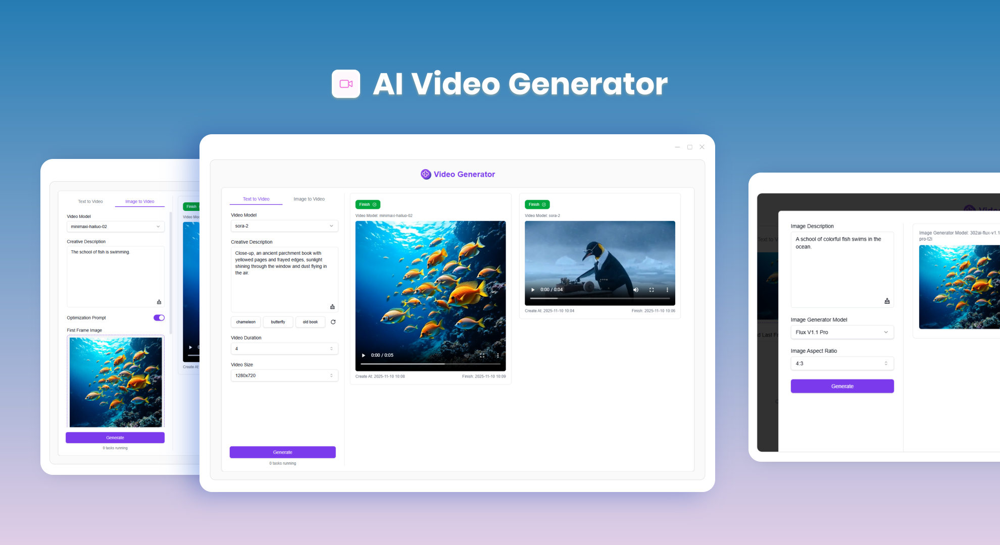

# <p align="center"> 🎬 AI Video Generator 🚀✨</p>

<p align="center">AI Video Generator generates high-quality AI videos from text and images using industry-leading video models like Luma, Runway gen-3, Kling, CogVideoX, and more.</p>

<p align="center"><a href="https://302.ai/product/detail/26" target="blank"></a></p >

<p align="center"><a href="README.md">中文</a> | <strong><a href="README_en.md">English</a></strong> | <a href="README_ja.md">日本語</a></p>



The open-source version of [AI Video Generator](https://302.ai/product/detail/26) from [302.AI](https://302.ai). You can log in to 302.AI directly to use the online version with zero code and zero configuration. Or modify this project according to your needs, pass in 302.AI's API KEY, and deploy it yourself.

## Interface Preview

Select a video model, enter prompts and set parameters to generate high-quality AI videos with one click


Upload local images or AI-generated images, enter prompts and set parameters to generate high-quality AI videos


Support multiple AI models to generate images, and use the generated images for AI video creation with one click


## Project Features

### 🧩 Multi-Model Support

    Different models provide different configuration options, including camera control and video effects

### 🎛️ Multi-Mode Selection

    Offers two modes: text-to-video and image-to-video, choose according to your needs

### 🖼️ AI Image Generation

    Generate AI images with one click and use them for video creation

### 📜 History

    Save your creation history, memories are never lost, download anytime anywhere.

### 🌓 Dark Mode

    Switch freely to protect your eyes.

### 🌐 Multi-Language & Internationalization Support

- Chinese Interface
- English Interface
- Japanese Interface

## 🚩 Future Updates

- [ ] Add more video models

## 🛠️ Tech Stack

- **Framework**: Next.js 14
- **Language**: TypeScript
- **Styling**: TailwindCSS
- **UI Components**: Radix UI
- **State Management**: Jotai
- **Form Handling**: React Hook Form
- **HTTP Client**: ky
- **Internationalization**: next-intl
- **Theme**: next-themes
- **Code Standards**: ESLint, Prettier
- **Commit Standards**: Husky, Commitlint

## Development & Deployment

1. Clone the project

```bash
git clone https://github.com/302ai/302-video-generator-public
cd 302-video-generator-public
```

2. Install dependencies

```bash
yarn install
```

3. Environment configuration

```bash
cp .env.example .env.local
```

Modify environment variables in `.env.local` as needed.

4. Start development server

```bash
yarn dev
```

5. Build production version

```bash
yarn build
yarn start
```

## ✨ About 302.AI ✨

[302.AI](https://302.ai) is a pay-as-you-go AI application platform that solves the last mile problem of AI in practice for users.

1. 🧠 Brings together the latest and most comprehensive AI capabilities and brands, including but not limited to language models, image models, voice models, and video models.
2. 🚀 Deep application development based on foundation models, we develop real AI products, not just simple chatbots
3. 💰 Zero monthly fees, all features are pay-as-you-go, fully open, truly low threshold, high ceiling.
4. 🛠 Powerful management backend, for teams and SMEs, one person manages, multiple people use.
5. 🔗 All AI capabilities provide API access, all tools are open source and customizable (in progress).
6. 💡 Strong development team, launching 2-3 new applications every week, products updated daily. Developers interested in joining are welcome to contact us
