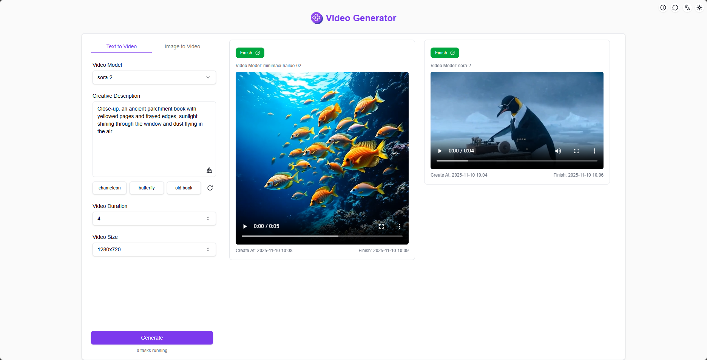
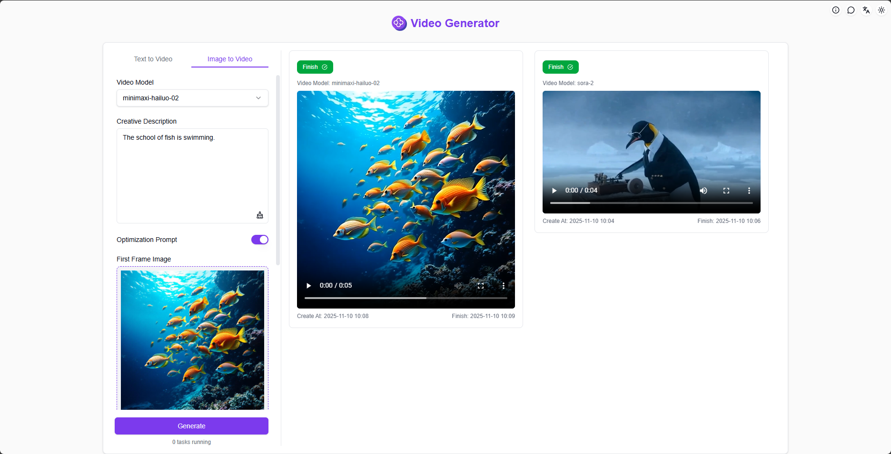
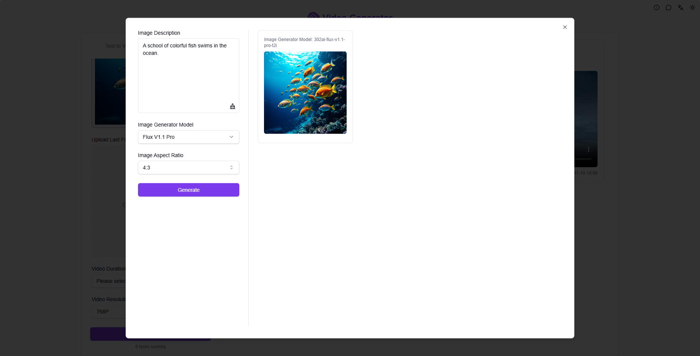

# <p align="center"> 🎬 AI Video Generator 🚀✨</p>

<p align="center">AI Video Generator generates high-quality AI videos from text and images using industry-leading video models like Luma, Runway gen-3, Kling, CogVideoX, and more.</p>

<p align="center"><a href="README.md">中文</a> | <strong><a href="README_en.md">English</a></strong> | <a href="README_ja.md">日本語</a></p>

AI Video Generator generates high-quality AI videos from text and images using industry-leading video models like Luma, Runway gen-3, Kling, CogVideoX, and more. You can modify this project according to your needs and deploy it yourself.

## Interface Preview

Select a video model, enter prompts and set parameters to generate high-quality AI videos with one click


Upload local images or AI-generated images, enter prompts and set parameters to generate high-quality AI videos


Support multiple AI models to generate images, and use the generated images for AI video creation with one click


## Project Features

### 🧩 Multi-Model Support

    Different models provide different configuration options, including camera control and video effects

### 🎛️ Multi-Mode Selection

    Offers two modes: text-to-video and image-to-video, choose according to your needs

### 🖼️ AI Image Generation

    Generate AI images with one click and use them for video creation

### 📜 History

    Save your creation history, memories are never lost, download anytime anywhere.

### 🌓 Dark Mode

    Switch freely to protect your eyes.

### 🌐 Multi-Language & Internationalization Support

- Chinese Interface
- English Interface
- Japanese Interface

## 🚩 Future Updates

- [ ] Add more video models

## 🛠️ Tech Stack

- **Framework**: Next.js 14
- **Language**: TypeScript
- **Styling**: TailwindCSS
- **UI Components**: Radix UI
- **State Management**: Jotai
- **Form Handling**: React Hook Form
- **HTTP Client**: ky
- **Internationalization**: next-intl
- **Theme**: next-themes
- **Code Standards**: ESLint, Prettier
- **Commit Standards**: Husky, Commitlint

## Development & Deployment

1. Clone the project

```bash
git clone https://github.com/302ai/302-video-generator-public
cd 302-video-generator-public
```

2. Install dependencies

```bash
yarn install
```

3. Environment configuration

```bash
cp .env.example .env.local
```

Modify environment variables in `.env.local` as needed.

4. Start development server

```bash
yarn dev
```

5. Build production version

```bash
yarn build
yarn start
```


