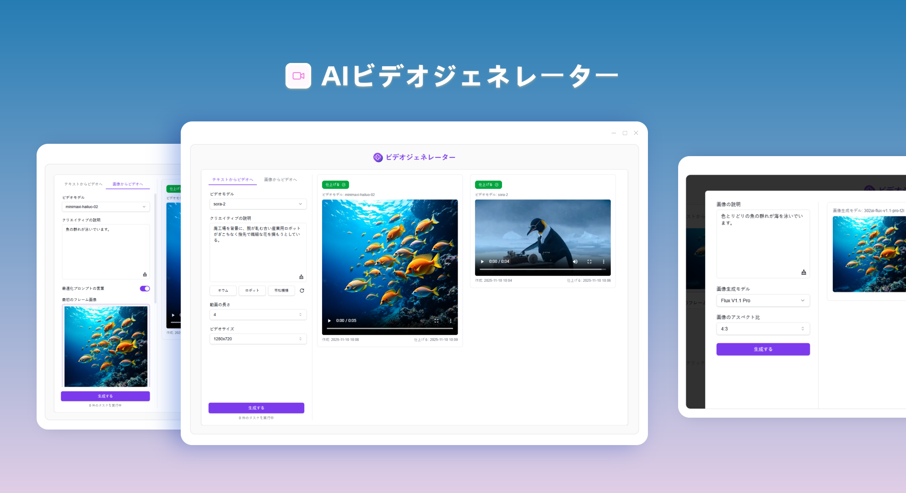
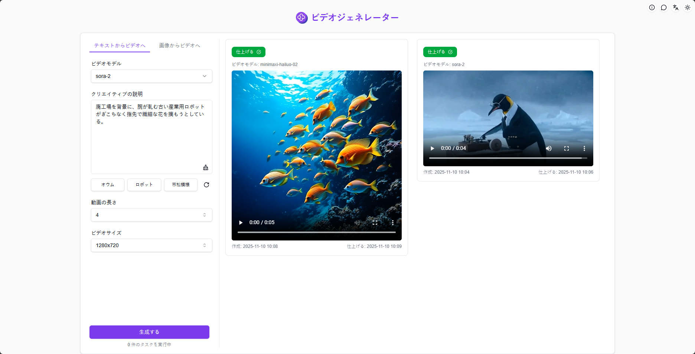
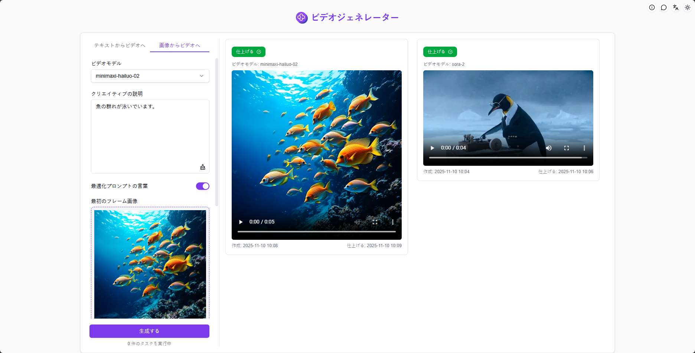
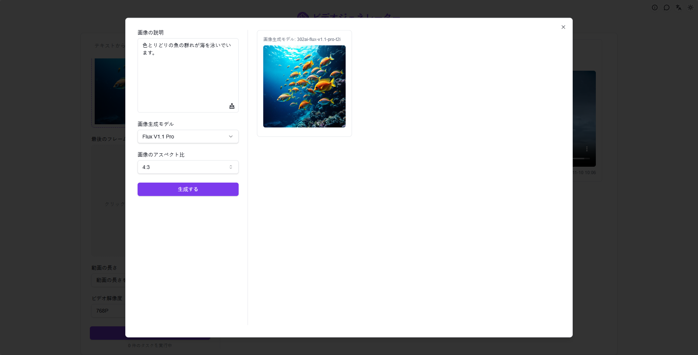

# <p align="center"> 🎬 AIビデオジェネレーター 🚀✨</p>

<p align="center">AIビデオジェネレーターは、テキストや画像に基づき、Luma、Runway gen-3、kling、CogVideoXなど業界最先端のビデオ生成AIモデルを活用して高品質なAI動画を生成します。</p>

<p align="center"><a href="https://302.ai/product/detail/26" target="blank"></a></p >

<p align="center"><a href="README.md">中文</a> | <a href="README_en.md">English</a> | <strong><a href="README_ja.md">日本語</a></strong></p>



[302.AI](https://302.ai/ja/)の[AIビデオジェネレーター](https://302.ai/product/detail/26)のオープンソース版です。
302.AIに直接ログインすることで、コード不要、設定不要のオンライン体験が可能です。
あるいは、このプロジェクトをニーズに合わせてカスタマイズし、302.AIのAPI KEYを統合して、自身でデプロイすることもできます。

## インターフェースプレビュー
動画生成モデルを選択し、プロンプトを入力してパラメータを設定し、ワンクリックで高品質のAI動画を生成できます。


ローカル画像やAI生成画像をアップロードし、プロンプトを入力してパラメータを設定すれば、高品質のAI動画を生成できます。
           

複数のAIモデルによる画像生成をサポートし、生成した画像でそのままAI動画作成が可能です。
                  

## プロジェクトの特徴
### 🧩 複数モデル対応
    モデルごとに異なる設定オプション（カメラコントロール、動画エフェクト等）を提供
### 🎛️ 複数モード選択
    テキストから動画、画像から動画の2つのモードを用途に応じて切り替え可能
### 🖼️ AI画像生成
    ワンクリックでAI画像を生成し、その画像を動画制作に活用
### 📜 履歴管理
    創作履歴を保存し、いつでもどこでもダウンロード可能。記録を失いません
### 🌓 ダークモード
    自由に切替可能で、目を保護
### 🌍 多言語サポート
- 中国語インターフェース
- 英語インターフェース
- 日本語インターフェース

## 🚩 今後のアップデート計画
- [ ] より多くの動画生成モデルの追加

## 🛠️ 技術スタック

- **フレームワーク**: Next.js 14
- **言語**: TypeScript
- **スタイリング**: TailwindCSS
- **UIコンポーネント**: Radix UI
- **状態管理**: Jotai
- **フォーム処理**: React Hook Form
- **HTTPクライアント**: ky
- **国際化**: next-intl
- **テーマ**: next-themes
- **コード規約**: ESLint, Prettier
- **コミット規約**: Husky, Commitlint

## 開発&デプロイ
1. プロジェクトのクローン
```bash
git clone https://github.com/302ai/302-video-generator-public
cd 302-video-generator-public
```

2. 依存関係のインストール
```bash
yarn install
```

3. 環境設定
```bash
cp .env.example .env.local
```
必要に応じて`.env.local`の環境変数を修正してください。

4. 開発サーバーの起動
```bash
yarn dev
```

5. プロダクションビルド
```bash
yarn build
yarn start
```

## ✨ 302.AIについて ✨
[302.AI](https://302.ai/ja/)は企業向けのAIアプリケーションプラットフォームであり、必要に応じて支払い、すぐに使用できるオープンソースのエコシステムです。✨
1. 🧠 包括的なAI機能：主要AIブランドの最新の言語、画像、音声、ビデオモデルを統合。
2. 🚀 高度なアプリケーション開発：単なるシンプルなチャットボットではなく、本格的なAI製品を構築。
3. 💰 月額料金なし：すべての機能が従量制で、完全にアクセス可能。低い参入障壁と高い可能性を確保。
4. 🛠 強力な管理ダッシュボード：チームやSME向けに設計 - 一人で管理し、多くの人が使用可能。
5. 🔗 すべてのAI機能へのAPIアクセス：すべてのツールはオープンソースでカスタマイズ可能（進行中）。
6. 💪 強力な開発チーム：大規模で高度なスキルを持つ開発者集団。毎週2-3の新しいアプリケーションをリリースし、毎日製品更新を行っています。才能ある開発者の参加を歓迎します。